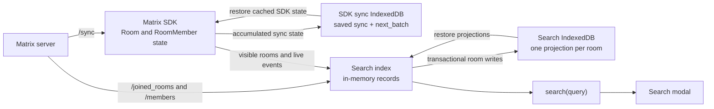
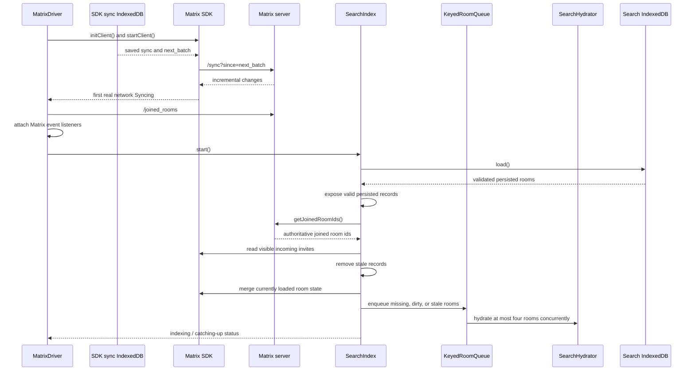

# Matrix Conversation Search

This document explains how the Matrix conversation search projection is built,
persisted, reconciled, queried, and kept current. It is intended for
contributors changing Matrix room membership, chat search, or IndexedDB
persistence.

## Goal

Conversation search must remain responsive even when an account belongs to many
Matrix rooms. Typing in the search modal must not trigger Matrix requests.

The implementation therefore maintains a local projection containing only the
fields needed by search:

- the explicit name of a group room;
- the current user's membership;
- current joined members;
- pending invited members.

The projection is kept in memory for synchronous searches and persisted in a
dedicated IndexedDB database so results can be restored after a reload.

## Relevant Files

- `src/frontend/apps/hub/src/features/matrix/search/MatrixConversationSearchIndex.ts`
  orchestrates reconciliation, persistence, lifecycle, and status reporting.
- `src/frontend/apps/hub/src/features/matrix/search/MatrixConversationSearchProjection.ts`
  owns the record model and pure member, room, and search transformations.
- `src/frontend/apps/hub/src/features/matrix/search/MatrixConversationSearchHydrator.ts`
  builds room records from SDK state or `/members`, including rate-limit retry.
- `src/frontend/apps/hub/src/features/matrix/search/KeyedRoomQueue.ts` owns
  bounded concurrency, pending-work deduplication, and per-room serialization.
- `src/frontend/apps/hub/src/features/matrix/search/MatrixConversationSearchStore.ts`
  owns the dedicated IndexedDB database and transactional room writes.
- `src/frontend/apps/hub/src/features/matrix/initMatrix.ts` creates and restores
  the Matrix SDK stores, validates cached joined rooms, and waits for the first
  real network sync.
- `src/frontend/apps/hub/src/features/drivers/implementations/MatrixDriver.ts`
  starts the Matrix client, installs event listeners, creates the index, and
  forwards Matrix SDK events to it.
- `src/frontend/apps/hub/src/features/chat/hooks/useChatSearch.ts` merges search
  results from active account drivers.
- `src/frontend/apps/hub/src/features/chat/components/ChatSearchModal.tsx`
  renders active conversations before pending invitations.

## Architecture

The index reconciles three sources of truth:



Each source has a different responsibility:

- `/sync` updates the Matrix SDK's room state and advances its batch token;
- the SDK sync IndexedDB restores that room state after a browser reload;
- `/joined_rooms` is authoritative for rooms the current user has joined;
- the SDK exposes pending incoming invitations and live room-state changes;
- the search IndexedDB restores the last durable search projection;
- the in-memory map supplies the searchable fields while the user types. The
  corresponding SDK room is read only to map a match for rendering and
  navigation; search performs no Matrix network or IndexedDB I/O.

Persisted data is validated by the Store before it enters memory. A record is
searchable only while it still matches current membership and has a
corresponding room in the Matrix SDK. A database-version change clears the
rebuildable projection rather than mixing record formats.

## Storage Boundaries

The application uses separate browser databases with different lifecycles.
They must not be treated as one cache.

### Matrix SDK Sync Store

`initMatrix.ts` gives `matrix-js-sdk` an account-scoped `IndexedDBStore`. It
persists an accumulated sync snapshot and the corresponding `next_batch`
token. On a warm start, the SDK can rebuild its in-memory `Room` models from
that snapshot and continue with `/sync?since=<next_batch>` instead of fetching
an entirely new initial state.

This store belongs to the SDK. It is not a historical event log and it is not
queried when the user types. In the currently locked `matrix-js-sdk` 41.6.0,
the first eligible save is immediate and later durable sync-store saves are
normally spaced by five minutes. This is an SDK implementation detail, not a
Hub contract. A hard browser shutdown can therefore leave the persisted token
behind the latest response processed in memory. Restarting from that older
token may replay already-seen events; SDK/event deduplication and semantic
record comparison make that safe.

The sync store is also separate from the Rust Crypto databases. Clearing the
search projection must never clear either sync state or encryption material.

### Conversation Search Store

`MatrixConversationSearchStore` owns a dedicated account-, homeserver-, and
MXID-scoped database. It stores one simplified, rebuildable projection per
room. The index reads every projection once during `start()`, then serves
searches from memory. Live changes write only the affected room.

An ordinary reload closes and reopens this database without deleting it.
Logout or invalid session cleanup deletes the account's search database after
stopping its workers. Corruption recovery resets only this disposable store.

## Data Model

### Member Record

Each counterpart is stored as:

```ts
type MatrixConversationSearchMemberRecord = {
  userId: string;
  displayName: string;
};
```

The Matrix user id is used as a fallback when no display name is available.
Member arrays are sorted by user id before comparison and persistence. Stable
ordering prevents SDK iteration order from causing unnecessary IndexedDB
writes.

### Room Record

Each room is stored as:

```ts
type MatrixConversationSearchRoomRecord = {
  roomId: string;
  explicitName?: string;
  currentUserMembership: "join" | "invite";
  memberIndexMode: "full" | "name-only";
  joinedMembers: MatrixConversationSearchMemberRecord[];
  invitedMembers: MatrixConversationSearchMemberRecord[];
};
```

`currentUserMembership` and `invitedMembers` describe different situations:

- `currentUserMembership === "invite"` means the current user received an
  invitation;
- `currentUserMembership === "join"` with a non-empty `invitedMembers` array
  means the current user joined the room and is waiting for other people to
  accept an invitation.

Only an explicit `m.room.name` event is persisted as `explicitName`. The SDK's
computed `room.name` is not used here because direct-message names are derived
from room members and can change as membership changes.

### Large Rooms

Joined rooms whose member count exceeds a cap are indexed in `name-only` mode:
no joined members are persisted, so active search matches only the explicit
room name. Pending invited members remain persisted and searchable in the
invitation section. Joined membership of a large channel carries no search
signal — any common first name would match every big room and drown the useful
results — and its `/members` payload is the main scaling hazard with thousands
of rooms.

- The decision reads `room.getJoinedMemberCount()`, backed by the sync
  summary's `m.joined_member_count`, so no member loading or network request
  is needed. A new room indexes its members at or under
  `MEMBER_INDEX_MAX_JOINED_MEMBERS` (50); an established _joined_ `full`
  record only demotes above `MEMBER_INDEX_DOWNGRADE_JOINED_MEMBERS` (70) —
  including on full re-hydrations — so a room oscillating around the cap does
  not flap between modes. A record inherited from the invite phase gets no
  such credit: accepting an invitation indexes like a fresh join.
- Only joined members are dropped. `name-only` records keep pending
  invitations — few in practice, and they are what makes the invitation
  section work, including for invitations into large channels. A rebuild
  merges the durable invitation snapshot with live SDK state instead of
  trusting the (possibly sparse) lazy-loaded state alone.
- When the sync summary is absent the SDK under-counts; an oversized member
  snapshot therefore demotes to `name-only` after hydration instead of being
  persisted. Because the same under-count would promote that room again on
  the next reconciliation, promotion is attempted at most once per latch
  window: the attempt is released when a full snapshot commits, when the room
  leaves the index, and on the user-triggered `resume()` retry.
- A live join crossing the cap converts the record in place. Joined-member
  events on a `name-only` room are dropped by normalization, while its
  invitation changes still apply.
- Promotion back under the cap only happens during reconciliation, through a
  full re-hydration — partial SDK merges cannot rebuild a complete member
  list.
- `name-only` records are first-class indexed records: they count in progress
  reporting, and their explicit name matches even when the SDK's partial
  member view would classify the room as direct. For matching purposes, the
  explicit name remains authoritative for this group-like record.

Incoming invite rooms always keep their members. Their sync state is usually
sparse and identifies the invitation row, but the code imposes no size cap on
it. Pathological invite counts therefore remain a known unbounded case because
the invitation data is what search renders.

## Database Isolation and Recovery

Conversation search owns a dedicated account- and user-scoped IndexedDB
database. It does not share stores with Matrix sync or Rust crypto.

This isolation is deliberate: search data is a rebuildable projection. Ordinary
read failures, an invalid schema, or invalid runtime data trigger one deletion
and recreation of only the search database. Matrix sync state and encryption
keys are never affected. IndexedDB absence, a newer schema, or an operation
blocked by another tab cannot be recovered by deletion. A newer schema or an
initially blocked open bypasses reset; an unavailable database or a reset that
becomes blocked fails before a second open is attempted.

The store validates data loaded from IndexedDB because TypeScript types do not
exist at runtime. A record with the wrong shape causes one reset-and-retry.

A schema-version bump clears `rooms` and removes the former `metadata` store
inside `onupgradeneeded`, so upgrading clients rebuild through normal
reconciliation. `VersionError` — another tab
already upgraded the database to a newer schema than this code knows — is the
one open failure that must never trigger deletion: dropping the database would
destroy the other tab's freshly built index. The index treats it as terminal
for the session (`storeBroken`): new reconciliation and hydration work plus
`resume()` stop, and the pending hydration queue is dropped. A Matrix request
already in flight may finish, but its result is discarded. Already-loaded
records stay searchable, and a page reload recovers. A blocked opening fails
without deleting data because it
usually means another tab still owns a connection, not that the data is corrupt.
A blocked reset does not immediately queue another open behind the pending
deletion. Both cases remain retryable through `resume()` once the other tab has
released its connection; a reload also creates a fresh store instance.

## Startup and Restart Sequence

Search-index startup happens only after the Matrix client has restored and
caught up its own state. This ordering is important: the search projection
builds from current SDK rooms, not directly from the raw saved `/sync` payload.

### Phase 1: Open and Validate the Matrix Client

`MatrixDriver.bootstrapClient()` creates the client through `initClient()` with
account-scoped sync and crypto database names. `startupClient()` then:

1. calls `whoami()` to validate or refresh the persisted OIDC session;
2. opens the SDK `IndexedDBStore`;
3. calls `discardStaleJoinedRooms()`;
4. initializes Rust Crypto.

`discardStaleJoinedRooms()` reads joined rooms from the saved sync snapshot and
compares them with the server's current `/joined_rooms` response. If at least
one cached joined room is no longer joined, the saved SDK sync data is cleared.
This protects ordinary leave/kick changes made from another client and local
homeserver resets from replaying rooms which no longer exist. OIDC and Rust
Crypto data are preserved by this targeted cleanup.

When the sync cache is cleared or absent, the next request is a fresh initial
sync. Otherwise the SDK can resume from its saved token.

### Phase 2: Restore and Catch Up `/sync`

The client starts with `lazyLoadMembers: true`, thread support, and an initial
timeline limit of 50 when no saved sync token exists.

On a warm start, `matrix-js-sdk`:

1. replays the saved sync snapshot to rebuild in-memory `Room` state;
2. restores its persisted `next_batch` token;
3. requests `/sync?since=<next_batch>` to receive subsequent changes;
4. processes and accumulates the new response for later persistence.

Cached replay may emit a prepared state before the network is current.
`waitForInitialSync()` therefore waits for `Syncing` with neither `fromCache`
nor `catchingUp` before `bootstrapClient()` continues.

The Matrix [sync specification][matrix-sync] defines `next_batch` as the
continuation point for the next `since` request.
Normally the incremental response contains new visible events. If a room
timeline is limited, intermediate timeline events may be omitted and a state
delta represents changes across the gap. Search needs the resulting current
membership state; it does not preserve an audit log of every intermediate
transition.

With [lazy-loaded members][matrix-lazy-members], `/sync` does not resend the
full unchanged member list for every room. A full list is loaded only when
needed, then subsequent membership state changes keep the local projection
current.

### Phase 3: Attach Listeners and Start Search

After the first real network sync, `MatrixDriver` refreshes `/joined_rooms`,
attaches its Matrix event listeners, and finally calls
`startConversationSearchIndex()`.

This means events processed during the first catch-up do not necessarily pass
one by one through `handleMember()`. They have already updated the SDK's `Room`
models. The initial search reconciliation merges that current SDK state into
persisted records. Later incremental sync events are handled directly by the
installed live listeners.

Search-index startup is detached from the main `connect()` result so the
application does not wait for every room to be hydrated before becoming usable.



Once reconciliation has established the current joined/invited room sets,
valid persisted records can remain searchable while background hydration
continues. The phase is `catching-up`. A first build with no persisted result
uses the `indexing` phase.

## Reconciliation

Reconciliation establishes which records are allowed to remain searchable.

The process is:

1. fetch the authoritative joined-room ids;
2. collect incoming invite ids from visible SDK rooms;
3. form the union of joined and invited rooms;
4. delete persisted rooms outside that union;
5. merge live SDK state into current persisted records;
6. enqueue records that are missing, dirty, eligible for promotion, or have
   stale membership;
7. finish as `ready` when no work remains, otherwise start background workers.

If `/joined_rooms` fails, existing durable records are preserved as an offline
fallback. The index still enters `error`, because it cannot prove that the
persisted membership is current.

## Background Hydration

`KeyedRoomQueue` runs at most four room workers at once. It deduplicates only
pending work, so a room may deliberately be queued again while its current
hydration is running. A room is queued only while it is joined or is an incoming
invitation.

`MatrixConversationSearchHydrator` builds the record. For an incoming invite, or
when the SDK already loaded all members, it uses SDK room state. Incoming invites
commonly expose sparse state and may not allow a `/members` request.

For a joined room whose members are not fully loaded, the worker calls
`/rooms/{roomId}/members`, excluding `leave` membership. It persists only
`join` and `invite` events. This single background request is what makes pending
outgoing invitations searchable. Rooms whose sync summary already exposes a
count above the member cap skip this request and hydrate directly as `name-only`
records. If that summary is absent or under-counted, the post-hydration guard
can still demote the returned snapshot (see Large Rooms).

Rate-limited requests are retried up to three times after the initial attempt.
The delay uses Matrix `Retry-After` information when available and otherwise
falls back to exponential backoff, capped at 30 seconds.

## Two Member-Loading Paths

The conversation search hydrator and the normal member-list UI can both obtain
room members, but they do not use the same method or the same IndexedDB data.

### Search Projection Hydration

For a small joined room whose members are not already complete in SDK memory,
`MatrixConversationSearchHydrator` calls `client.members()` directly. Without
an `at` token, the [Matrix members endpoint][matrix-members] returns the room's
current membership state. The hydrator keeps only `join` and `invite`, excludes
the current user, and returns the simplified record to
`MatrixConversationSearchIndex` for persistence in the dedicated search
database.

This direct request does not call `room.loadMembersIfNeeded()` and does not use
the SDK out-of-band member cache as its persistence target. If
`room.membersLoaded()` is already true, the hydrator reuses the complete SDK
state and skips the request entirely.

### Conversation Member List

`MatrixDriver.getChatMembers()` serves the normal room member list. It first
verifies that the current user is joined, then calls
`room.loadMembersIfNeeded()`. With lazy loading enabled, the SDK can restore
out-of-band members from its own store or request `/members`, populate the
room's in-memory state, and cache a server-loaded list in the SDK store.

After loading, `getChatMembers()` maps joined members to `present` and invited
members to `pendingInvites`. This UI path may indirectly help later search
hydration because `room.membersLoaded()` will then be true, but the two durable
stores remain independent.

## Live Event Maintenance

`MatrixDriver` forwards the relevant SDK events to the Index. Member and name
mutations use the pure transformations from
`MatrixConversationSearchProjection` and are ordered per room through
`KeyedRoomQueue`:

- member changes update `joinedMembers` and `invitedMembers`;
- room-name changes update the explicit group name;
- current-user membership changes move a room between joined and incoming
  invitation sets, or remove it entirely; durable removals use the global
  persistence queue;
- newly visible rooms are inspected for `join` or `invite` membership;
- the first network sync and later reconnect transitions trigger
  reconciliation; steady-state sync updates are maintained by live events.

Events received before the initial IndexedDB and `/joined_rooms` snapshot are
recorded as dirty room ids. Reconciliation later queues those rooms so early
events are not lost.

The handlers have deliberately different scopes:

- `handleMember()` handles another user's membership or profile. It updates,
  moves, or removes that member inside the persisted room record.
- `handleName()` handles explicit `m.room.name` changes and updates only that
  persisted field.
- `handleMyMembership()` handles the current user's join, invite, leave,
  reject, kick, or ban. It decides whether the whole room belongs in the index.
- `handleRoom()` handles a newly visible SDK room and delegates current
  `join`/`invite` state to `handleMyMembership()`.
- `reconcile()` handles the first real network sync or a reconnect by
  rechecking the complete current room set and queueing repairs.

`handleMyMembership()` increments the room revision before doing anything. A
leave/reject/kick/ban removes the room from joined and invited sets, cancels
pending hydration, and serializes deletion of the whole durable record. A join
or incoming invitation updates the appropriate set and queues hydration. This
is separate from `handleMember()`, which never decides whether the room itself
belongs in the current user's search index.

## Search Semantics

`search(query)` is synchronous apart from its public Promise-based driver
wrapper. It performs no Matrix or IndexedDB I/O. `matchRoomRecord()` computes
field ranks first and converts only matching rooms to `LocalChat` results.

The query is matched against:

- the explicit group name;
- joined member display names;
- invited member display names.

Match ranks are:

- `0` for an exact match;
- `1` for a prefix match;
- `2` for a partial match.

The section is selected with these rules:

| Current user | Matching field                        | Section            | Direction |
| ------------ | ------------------------------------- | ------------------ | --------- |
| joined       | group name or joined member            | active             | none      |
| joined       | invited member only                    | pending invitation | outgoing  |
| invited      | group name, joined or invited member   | pending invitation | incoming  |

An active match wins when the same joined room matches both a joined member and
an invited member. This prevents the same room from appearing in both sections
for one query.

Results are sorted by match rank, normalized chat name, and room id. The modal
then renders active conversations before pending invitations.

### Outgoing Invitation Example

Assume the current user has joined a direct room and Chromium is still invited:

```ts
{
  currentUserMembership: "join",
  joinedMembers: [],
  invitedMembers: [
    {
      userId: "@chromium:localhost",
      displayName: "E2E Chromium",
    },
  ],
}
```

Searching for `Chro` has no active-member match but has an invited-member
match. The result is returned in the invitation section with direction
`outgoing`.

When Chromium accepts, the member event moves Chromium from `invitedMembers` to
`joinedMembers`. The same query then returns the room as an active conversation.

## Concurrency and Stale-Write Protection

Several asynchronous sources can change the same room at once: startup
reconciliation, `/members`, live membership events, room-name events, and
teardown. The index uses complementary guards rather than relying on one global
lock.

### Per-Room Serialization

`KeyedRoomQueue.serialize()` chains operations for the same room. Different
rooms can still run concurrently, but two updates for one room are ordered.

### Global Persistence Serialization

`serializePersistence()` preserves invocation order across IndexedDB mutations.
In particular, a later leave must not be overtaken by an older room write.

### Room Revisions

Each relevant live event increments a room revision. A worker captures the
revision before awaiting `/members`. If the revision changed while the request
was in flight, the response is discarded and the room is queued again.

### Generations

The index generation increments during `stop()`. Operations capture the current
generation before asynchronous work and verify it after each important await,
including durable writes and deletions. Old operations may finish at the
JavaScript or IndexedDB level, but they cannot mutate the stopped in-memory
index. Teardown waits for persistence already in flight, but not for potentially
slow Matrix requests whose eventual responses are discarded.

### Queue Deduplication

The Queue owns a pending-id set beside its FIFO. The marker is removed when a
worker starts, so a live event may deliberately queue another pass while the
first pass is still running.

## Status and UI Updates

The index reports:

- the current phase;
- count of persisted records whose membership still matches the current joined
  or invited sets (an SDK room is also required before search can render one);
- current total room count;
- failed room count;
- whether search results changed.

Progress notifications are throttled to one per second to avoid invalidating
React Query state for every room in a large account. Important terminal
transitions such as `ready` and `error` are published immediately.
Phase and counters exist only in memory and are reconstructed every session.

The search modal displays an incomplete-index warning whenever the phase is
`error`. Existing valid records remain searchable, so the warning may coexist
with partial results.

Opening the search modal calls `resume()` when the index is in error. The first
network sync and later reconnect transitions also trigger reconciliation;
steady-state syncs rely on live events. There is no periodic retry timer.

## Error Handling

Expected 403 and 404 errors during room hydration trigger a fresh room-list
reconciliation. If the room disappeared from the current set, its record is
removed normally. If Matrix still reports it as current, the room is marked as
failed.

Other hydration errors mark the room as failed. The queue continues processing
other rooms, then finishes in `error` if any failure remains.

Persistence errors from live mutations immediately move the index to `error`.
A persistence failure inside a hydration worker marks that room failed and the
queue publishes `error` when it becomes idle. Logs intentionally contain only
error kinds, HTTP status, and Matrix error codes; room names, member names, and
raw server messages are not logged.

## Multiple Tabs

Each tab owns its own Matrix client and in-memory index. Tabs may duplicate
background `/members` work, and the last IndexedDB commit wins between tabs.
Each transaction still prevents partial room records. Live events, or a
reconciliation backed by sufficiently complete SDK state, can repair an older
projection written by another tab; partial SDK state cannot guarantee that
repair immediately.

Connections listen for IndexedDB `versionchange` and close themselves so a
database upgrade or reset from another tab is not permanently blocked.

## Teardown

When the Matrix client is replaced or disconnected, the index:

1. marks itself stopped;
2. increments its generation;
3. stops `KeyedRoomQueue` and clears dirty rooms;
4. cancels pending status publication;
5. closes its IndexedDB store;
6. waits for persistence already in flight before logout can delete the
   account-scoped search database. It does not wait for slow Matrix hydration.

An index instance is not restarted after teardown. A new Matrix client creates
a new index and a new account-scoped store instance.

## Invariants to Preserve

Changes to this subsystem should preserve the following properties:

- SDK sync, search projection, and crypto stores remain separate;
- cached `Prepared` state is not treated as a completed network catch-up;
- initial search reconciliation runs after the first real network sync;
- typing never performs Matrix or IndexedDB I/O;
- `/joined_rooms` remains authoritative for joined membership;
- incoming invitations remain visible even though they are absent from
  `/joined_rooms`;
- outgoing invitations are indexed from current `invite` membership events;
- left, rejected, and cancelled rooms are removed from memory and IndexedDB;
- within one index instance, room revisions and lifecycle generations prevent a
  stale asynchronous response from overwriting a newer room event or a stopped
  in-memory index;
- search database recovery never deletes Matrix sync or crypto data;
- search hydration and `getChatMembers()` may share SDK memory but keep their
  persistence responsibilities separate;
- updates for one room stay serialized, and each IndexedDB room mutation is
  transactional;
- errors may expose partial durable results but must be visible through index
  status.

## Debugging Checklist

When a room is missing from search, check these layers in order:

1. Did the Matrix client reach a real network `Syncing` state, rather than only
   restoring cached `Prepared` state?
2. Is its id present in `/joined_rooms`, or is it a visible incoming invite?
3. Does `MatrixClient.getRoom(roomId)` return a room with current state?
4. Is the stale or missing value in SDK room state, or only in the dedicated
   search projection?
5. Did the search Store load and validate the record successfully?
6. Does `currentUserMembership` match the current joined or invited set?
7. Is the expected counterpart in `joinedMembers` or `invitedMembers`?
8. Is the index in `indexing`, `catching-up`, or `error`?
9. Did a `/members` request fail, rate-limit, or return 403/404?
10. Did a live event increment the room revision while hydration was running?

Network inspection while typing should show no `/members`, directory search, or
mutual-room request caused by the search input.

## References

- [Matrix client-server sync][matrix-sync]
- [Matrix lazy-loading room members][matrix-lazy-members]
- [Matrix room members endpoint][matrix-members]

[matrix-sync]: https://spec.matrix.org/latest/client-server-api/#syncing
[matrix-lazy-members]: https://spec.matrix.org/latest/client-server-api/#lazy-loading-room-members
[matrix-members]: https://spec.matrix.org/latest/client-server-api/#get_matrixclientv3roomsroomidmembers
